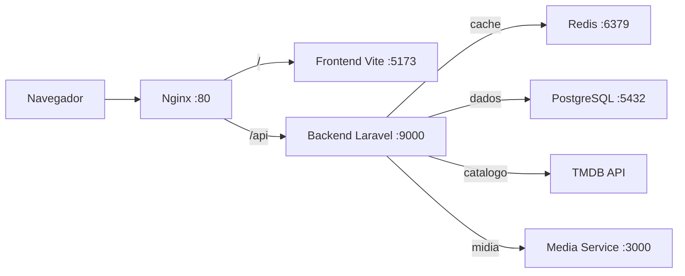

# Arquitetura

O Stretor é uma plataforma de processamento de mídia (vídeo/áudio) organizada em
microsserviços. Cada serviço tem uma responsabilidade clara e se comunica pela
rede interna do Docker.

## Visão geral

```
┌─────────────┐      ┌──────────────┐      ┌──────────────────┐
│  Frontend   │─────▶│   Backend    │─────▶│  Media Service   │
│  Vue 3      │      │  Laravel 11  │      │  Node + FFmpeg   │
│  (Vite)     │      │  (API REST)  │      │                  │
└─────────────┘      └──────┬───────┘      └────────┬─────────┘
                            │                       │
                     ┌──────▼───────┐        ┌──────▼───────┐
                     │  PostgreSQL  │        │    Redis     │
                     │     16       │        │   (cache)    │
                     └──────────────┘        └──────────────┘
```

## Componentes

| Serviço         | Stack                          | Porta padrão |
|-----------------|--------------------------------|--------------|
| `frontend`      | Vue 3 + Vite + Pinia + Tailwind| 5173 (interna) |
| `backend`       | Laravel 11 (PHP 8.3-FPM)       | 9000 (FPM)   |
| `nginx`         | Nginx 1.27 Alpine              | **80**       |
| `media-service` | Node.js 20 + FFmpeg            | 3000         |
| `postgres`      | PostgreSQL 16                  | 5432         |
| `redis`         | Redis 7 Alpine                 | 6379         |

> **Acesso principal:** http://localhost (Nginx na porta 80 faz proxy para o
> frontend Vite e para a API Laravel).

## Fluxo de uma requisição



O Nginx é o único ponto exposto. Ele decide, pelo caminho da URL, se a requisição
vai para o frontend (SPA) ou para a API. O backend, por sua vez, fala com o
PostgreSQL (dados), o Redis (cache) e o media-service (processamento de mídia).

## Estrutura de pastas

```
stretor/
├── backend/            # API Laravel 11
├── frontend/           # SPA Vue 3
├── media-service/      # Serviço Node.js + FFmpeg
├── docker/             # Dockerfiles e configs
│   ├── backend/
│   ├── frontend/
│   ├── media-service/
│   └── nginx/
├── docs/               # Manual do projeto (este diretório)
├── plans/              # Registro histórico das decisões de implementação
├── scripts/            # Scripts de apoio (bootstrap)
├── docker-compose.yml
├── Makefile
├── .env.example
└── README.md
```

## Camadas do backend

O backend segue separação por camadas, conforme as regras do projeto:

- **Controllers** — orquestram a requisição e devolvem a resposta.
- **Services** — concentram as regras de negócio (ex.: [`TmdbService.php`](../backend/app/Services/TmdbService.php:1)).
- **Models** — representam as entidades persistidas.
- **Migrations / Seeds** — versionam e populam o banco.
- **Enums** — valores de domínio tipados (ex.: [`Genero.php`](../backend/app/Enums/Genero.php:1)).
- **Support** — constantes e utilitários transversais (ex.: [`MensagensFilme.php`](../backend/app/Support/MensagensFilme.php:1)).

### Enums de domínio

Valores que antes viviam como arrays de constantes privadas dentro dos serviços
agora são **enums nativos do PHP 8.3** em `app/Enums/`. Isso dá tipagem,
autocomplete e um único ponto de verdade para cada mapa:

| Enum | Papel |
|------|-------|
| [`Genero.php`](../backend/app/Enums/Genero.php:1) | Ids de gênero do TMDB → rótulo em PT-BR. |
| [`ClassificacaoIndicativa.php`](../backend/app/Enums/ClassificacaoIndicativa.php:1) | Normalização das classificações brasileiras. |
| [`TamanhoImagem.php`](../backend/app/Enums/TamanhoImagem.php:1) | Sufixos de resolução da CDN do TMDB. |
| [`TipoVideo.php`](../backend/app/Enums/TipoVideo.php:1) | Tipo e provedor do trailer. |

Os textos de fallback do contrato (título/sinopse/gênero ausentes) ficam em
[`MensagensFilme.php`](../backend/app/Support/MensagensFilme.php:1), junto do
limite de elenco exibido no modal.

## Organização do frontend

O frontend separa responsabilidades em pastas próprias:

- **views/** — páginas (ex.: [`HomeView.vue`](../frontend/src/views/HomeView.vue:1)).
- **services/** — chamadas de API isoladas (ex.: [`movies.js`](../frontend/src/services/movies.js:1)).
- **stores/** — estado global com Pinia (ex.: [`movies.js`](../frontend/src/stores/movies.js:1)).
- **router/** — rotas em arquivo próprio.
- **components/** — toda a interface reutilizável. As views não criam componentes
  complexos diretamente; elas compõem componentes padrão via props/slots.
- **constants/** — valores fixos de domínio, UI e API (ex.: [`ui.js`](../frontend/src/constants/ui.js:1)).
- **composables/** — lógica reativa reutilizável (ex.: [`useDebounce.js`](../frontend/src/composables/useDebounce.js:1)).

### Constantes e composables

No Vue 3 os **mixins foram descontinuados** em favor dos **composables** — funções
que encapsulam lógica reativa e são importadas explicitamente por quem precisa
delas, sem o acoplamento implícito dos mixins.

- **`constants/`** — números e mapas que antes ficavam soltos nos componentes
  (tempos de animação, limites de exibição, timeout de requisição, gêneros).
  Os objetos são congelados com `Object.freeze` para evitar mutação acidental.
- **`composables/`** — comportamentos reutilizáveis, como
  [`useDebounce.js`](../frontend/src/composables/useDebounce.js:1) e
  [`useScrollSolidificacao.js`](../frontend/src/composables/useScrollSolidificacao.js:1),
  que cuidam do próprio ciclo de vida (`onMounted`/`onUnmounted`).
